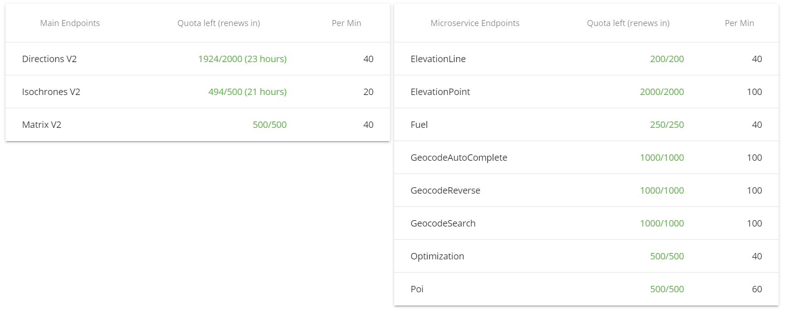

# Itinerary Optomization package for Python
旅行の予定を [openrouteservice](https://openrouteservice.org/) を用いて Python から最適化するためのパッケージです。

# インストール
このライブラリは Python3.11 で動作確認しています。
```
pip install git+https://github.com/Yuki1005/TripOpt.git
```

# 使い方
## 準備
はじめに、[openrouteserviceのページ](https://openrouteservice.org/) からアカウントを作成してAPIキーを取得します。  
APIキーを取得すると，下の図のように各機能が利用できる回数が表示されています。  
<br>
例えば経路検索に使うDirections V2 は，1日で無料の範囲で2000回 (1分で40回まで) 利用できることが分かります。  
  
次に行きたい場所のtextファイルを用意します。  
GoogleMapから取得したURLと滞在時間を2行で1セットとします。  
この時、1セット目にはホテルを入力し、滞在時間を0と入力してください。 
<br> 
<br>
例として  
```
https://www.google.co.jp/maps/place/%E4%BA%AC%E9%83%BD%E9%A7%85/@34.9858534,135.7561918,17z/data=!3m1!4b1!4m6!3m5!1s0x600108ae918b02ef:0xb61a446e74a21c08!8m2!3d34.985849!4d135.7587667!16zL20vMDIxMWRj?hl=ja&entry=ttu
0
https://www.google.co.jp/maps/place/%E8%B3%80%E8%8C%82%E5%BE%A1%E7%A5%96%E7%A5%9E%E7%A4%BE%EF%BC%88%E4%B8%8B%E9%B4%A8%E7%A5%9E%E7%A4%BE%EF%BC%89/@35.0389822,135.7704319,17z/data=!3m1!4b1!4m6!3m5!1s0x6001084046fc8d7f:0x3b83b327fe5cdcc!8m2!3d35.0389778!4d135.7730068!16s%2Fm%2F06ztvhn?hl=ja&entry=ttu
20
https://www.google.co.jp/maps/place/%E4%BC%8F%E8%A6%8B%E7%A8%B2%E8%8D%B7%E5%A4%A7%E7%A4%BE/@34.9748657,135.755955,15z/data=!4m10!1m2!2m1!1z5LyP6KaL56iy6I235aSn56S-!3m6!1s0x60010f153d2e6d21:0x7b1aca1c753ae2e9!8m2!3d34.9676945!4d135.7791876!15sChLkvI_opovnqLLojbflpKfnpL5aFiIU5LyP6KaLIOeosuiNtyDlpKfnpL6SAQ1zaGludG9fc2hyaW5l4AEA!16zL20vMDVsZHJt?hl=ja&entry=ttu
60
https://www.google.co.jp/maps/place/%E6%B8%85%E6%B0%B4%E5%AF%BA/@34.9948605,135.7824714,17z/data=!3m1!4b1!4m6!3m5!1s0x600108d385dcfb07:0x62af658650c434ba!8m2!3d34.9948561!4d135.7850463!16zL20vMDJ5bjNn?hl=ja&entry=ttu
50
https://www.google.co.jp/maps/place/%E6%9D%B1%E5%B1%B1%E6%85%88%E7%85%A7%E5%AF%BA/@35.0272628,135.7945173,17z/data=!4m10!1m2!2m1!1z6YqA6Zaj5a-6!3m6!1s0x600109050b426fe1:0x258aca1ce888abc9!8m2!3d35.0270213!4d135.7982058!15sCgnpioDplqPlr7paCyIJ6YqA6Zaj5a-6kgEPYnVkZGhpc3RfdGVtcGxl4AEA!16zL20vMDJ5NG05?hl=ja&entry=ttu
40
https://www.google.co.jp/maps/place/%E4%BA%AC%E9%83%BD%E3%82%BF%E3%83%AF%E3%83%BC/@34.9875936,135.7567649,17z/data=!3m1!5s0x600108afa9039257:0x6500bc26383b8a9d!4m10!1m2!2m1!1z5Lqs6YO944K_44Ov44O8!3m6!1s0x600108afa856da77:0xec2916eeff97bfd4!8m2!3d34.9875205!4d135.7592518!15sCg_kuqzpg73jgr_jg6_jg7xaEiIQ5Lqs6YO9IOOCv-ODr-ODvJIBEG9ic2VydmF0aW9uX2RlY2vgAQA!16zL20vMDVranQ0?hl=ja&entry=ttu
30
https://www.google.co.jp/maps/search/%E9%87%91%E9%96%A3%E5%AF%BA/@35.0395815,135.7269378,17z/data=!3m1!4b1?hl=ja&entry=ttu
40
https://www.google.co.jp/maps/place/%E4%BB%81%E5%92%8C%E5%AF%BA/@35.0288045,135.7118534,17z/data=!4m10!1m2!2m1!1z5LuB5ZKM5a-6!3m6!1s0x6001077ff3ae5187:0xea1bdd27377bb743!8m2!3d35.0310937!4d135.7138198!15sCgnku4Hlkozlr7paDCIK5LuB5ZKMIOWvupIBD2J1ZGRoaXN0X3RlbXBsZZoBI0NoWkRTVWhOTUc5blMwVkpRMEZuU1VOd1owbEllRlpuRUFF4AEA!16zL20vMDdrYmQx?hl=ja&entry=ttu
50
https://www.google.co.jp/maps/place/%E5%BB%BA%E4%BB%81%E5%AF%BA/@35.0002898,135.7713236,17z/data=!3m1!4b1!4m6!3m5!1s0x600108c1242b7b27:0x7e608f1986c5bb52!8m2!3d35.0002854!4d135.7738985!16s%2Fm%2F027phyz?hl=ja&entry=ttu
50
```

## 最適化
最適化された回り方のみを出力したい場合
```python
from TripOpt import *

f = open('', 'r', encoding='UTF-8')  #テキストファイルを一つ目の''の中に入力してください
pos_text = f.readlines()
OSM_key = " "  #APIキーを取得し""の中に入力してください
time_day = 60*60*8  #一日に使える時間を設定してください(秒単位)  例：60*60*8 ← 8時間
"""
<移動方法>
  0 → 歩き
  1 → 車
"""
method_num = 0  #移動方法を上記の表から選び、数字を入力してください
Optimization(geo=pos_text,key=OSM_key,lim_time=time_day,method_num=method_num)
```
  
加えてマップを可視化したい場合

```python
from TripOpt import *

f = open('', 'r', encoding='UTF-8')  #テキストファイルを一つ目の''の中に入力してください
pos_text = f.readlines()
OSM_key = " "  #APIキーを取得し""の中に入力してください
time_day = 60*60*8  #一日に使える時間を設定してください(秒単位)  例：60*60*8 ← 8時間
"""
<移動方法>
  0 → 歩き
  1 → 車
"""
method_num = 0  #移動方法を上記の表から選び、数字を入力してください
VisualizationMap(geo=pos_text,key=OSM_key,lim_time=time_day,method_num=method_num).map()
```

# License
This software is released under the MIT License, see LICENSE. 